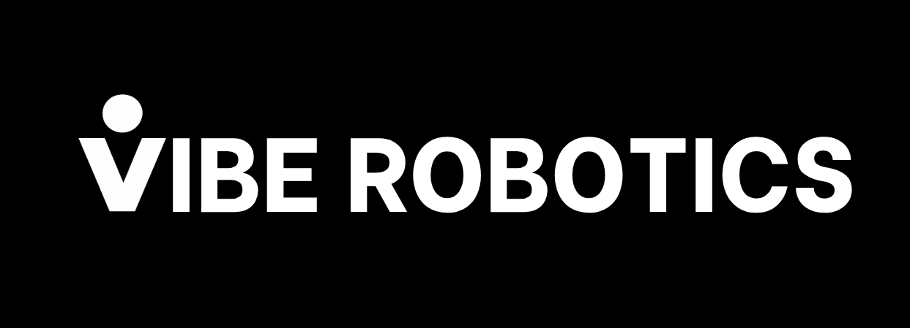

  

Vibe Robotics builds affordable humanoid robots designed for robotics research, education, and embodied AI development. Our flagship platform, **Sunday A1**, is a compact humanoid robot built to make humanoid robotics accessible to universities, developers, and students worldwide.

We focus on:
- Low-cost humanoid robot hardware
- Reinforcement learning for locomotion and manipulation
- Vision-Language-Action (VLA) robotics
- Open developer tools for embodied AI

<table><tbody>

    
    Open Source Projects

<table class="table table-striped table-bordered table-vcenter"/>
    <tbody>
    <tr><th> Title </th> <th>Description</th> <th>Stars</th> <th>Forks</th></tr>
    <tr>
        <td colspan="1" rowspan="1" align="center">
            <a href="https://github.com/viberobotics" target="_blank"> Locomotion & control </a>
        </td>
        <td><a href="https://github.com/viberobotics/vibe_robotics_sdk" target="_blank"> vibe_robotics_sdk</a>   Core stack: Sunday A1 Hardware Setup, ZMP-MPC walking, footstep planning, RL policy deployment, MuJoCo simulation, and FTServo hardware support. Raspberry Pi receiver, web controller, and joystick/teleop. </td>
        <td></td>
        <td></td>
    </tr>
    </tbody>
</table>

</tbody></table>
